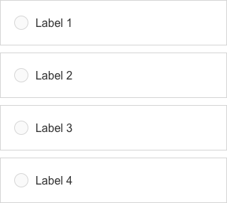

# Accordion / Accordéon

- Les accordéons sont des composants dynamiques qui permettent d’**optimiser l’affichage d’un contenu** dans un espace réduit grâce à un système de « plier/déplier » appliqué sur un groupe de panneaux.

- L'un des principaux avantages est que les accordéons permettent aux utilisateurs d'**avoir une vue d'ensemble avant de se concentrer sur un détail**.

## Usage

- Les accordéons sont utilisés pour gérer de grande quantité de contenus. Ce contenu est divisé et réduit en sections logiques disposés verticalement.

- L'utilisateur peut afficher le contenu de chaque section suite à un tape sur celle-ci. Ce contenu s’étend en poussant le reste de la page vers le bas. Lors d'un nouveau tape sur la section ouverte, le contenu déployé est masqué.

## Accordéon-radio

- L'accordéon-radio permet en plus de choisir une seule des section.

### Spécifications

- L'accordéon est **auto-fermant** : une seule des sections est ouverte à la fois. Quand une nouvelle section s'ouvre, la précédente section se ferme.
- Lors de l'ouverture d'une page, aucune ou une seule des section peut être ouverte.
- Les sections sont composées de contenus regroupés et organisés tels que du texte standard, des champs de texte, etc.
- La distance entre chaque section est 10px.
- Les spécifications du radio button sont décrites dans son doc design.
- Dans chaque section, le contenu déployé est au-moins à 22px sous le radio-bouton. Si le container est supérieur à 64px, il se situe à 10px sous le label.

Etat | Enabled | Select
------------ | ------------- |------------ |
Illustration |  |  | image 4 |
Container | Hauteur : minimum 64px et padding de 10px   Largeur : celle de son container parent moins le padding de celui-ci, 140px minimum   Fond : #FFFFFF   Contour : épaisseur 1px, #D4D4D4 | Hauteur : padding en haut 10px et padding en bas 20px   -   Fond : #FFFFFF   Contour : épaisseur 1px, #333333 | Opacité : 40 % | -   -   -   Contour : épaisseur 1px, #B40015 | Opacité : 40 % | Hauteur : 44px   Largeur : celle de son container parent moins le padding de celui-ci, 140px minimum   Fond : #FAFAFA   Contour : épaisseur 1px, #D4D4D4
Radio button | Marge à gauche : 20px   Marge à droite : 10px   Centré verticalement  | -   -   Placement vertical identique à l'état enabled

## Bonnes pratiques

- Les accordéons sont particulièrement utiles pour des interfaces Mobile first car ils réduisent les contenus volumineux dans de petits espaces.
- Le contenu doit être organisé de manière à simplifier la navigation.
- Cacher un contenu via un accordéon n'améliore pas nécessairement l'expérience utilisateur. Ils peuvent provoquer une désorientation. Aussi, le nombre d'interaction augmente.
- N'utilisez pas d'accordéons lorsque tout le contenu doit être vu sur une même page. Si les pages sont extrêmement longues, l'accordéon n'est peut-être pas approprié. Une approche différente de la navigation et de la mise en page devront être pensée.
