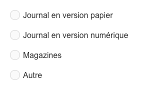

# Radio buttons / Boutons radio

Les boutons radio affichent un ensemble d’options parmi lesquelles l’utilisateur peut en sélectionner une seule.

## Usage

- Les boutons radio permettent de **choisir entre deux à cinq options**, par exemple une civilité.
- L’utilisateur peut **sélectionner une seule des options**.
- La sélection des boutons radio s’exclut mutuellement. Dans une liste, si l’un des boutons radio est activé, tous les autres sont désactivés.

## Spécifications

Desactivated / Hover | Actived / Focus | Error | Disabled
------------ | ------------- | ------------- | ------------- |
||  | 
Taille : 20x20px   Fond : #FAFAFA   Contour : épaisseur 1px, radius 100 % et #D4D4D4   Texte : 16px, regular, police du thème #333333   Margin right : 6px | -    Fond : #FFFFFF   Contour : épaisseur interne 7px, radius 100 % et #E2001A   -   - | -   Fond : #FAFAFA   Contour : épaisseur 1px, radius 100 % et #B40015    -   - | Opacité&nbsp;:&nbsp;40%

- La zone de touch contient le radio bouton et le texte associé. Sa hauteur est de 34px.

### Quantité

  |
------------ |
**Don’t**   N’utilisez jamais un seul bouton radio, une case à cocher est appropriée.

 |
------------ |
**Don't**   Si plusieurs éléments peuvent être choisis en même temps, utiliser des cases à cocher. |

 |
------------ |
**Don't**   Si le nombre d’option est supérieur ou égal à 4, utilisez un autre composant, par exemple un select. |

### Gestion des erreurs

Lorsqu’aucun bouton radio n’est coché par défaut et qu’un choix est obligatoire, un message d’erreur s’affiche 20px sous le dernier radio bouton.

### Bonnes pratiques

- La 1re lettre du texte est en majuscule, le reste est en minuscule.
- N’utilisez pas de point à la fin du texte.
- Le texte doit décrire le choix de manière claire et distincte.
- Afficher les options dans un ordre logique, par ex&nbsp;: les plus susceptibles d’être sélectionnées en premier.
- Lorsque l’espace est suffisant et que la lisibilité est optimale, les boutons radio sont disposés horizontalement. L’espacement entre chaque élément est constant.

- Par défaut, les boutons radio peuvent être désactivés ou bien activés. Cependant, il est préférable d’activer une des options, la plus probable ou la première.
- Si un état non sélectionné est nécessaire, ajoutez simplement un bouton radio “Aucun”.
- L’indicateur de groupe (composant Label) qui accompagne des boutons radio n’est pas obligatoire, ex : civilité.

## Autres composants

- Switch
- Checkbox
- Select
- Etc.
