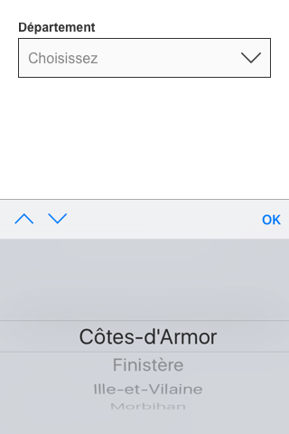
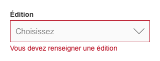

# Selects / Listes déroulantes

Les selects permettent à l’utilisateur de sélectionner une option dans une liste.

## Usage

- Un select permet d’**afficher un nombre illimité d'options dans une liste déroulante**. L’utilisateur peut **choisir une seule des options** parmi cette liste.
- Il empêche les utilisateurs de saisir des données erronées et il permet d'économiser quelques frappes.
- On le trouve généralement dans un formulaire.

## États

Type | Illustration
------------ | ------------- |
**Enabled** | 
**With default value** |
**With placeholder** |
**Focus** |
**Error** |
**Disabled** |

## Spécifications

### Label

- Le composant "Label" indique le type d’information demandée sous celui-ci.
- Ses spécifications sont disponibles dans son doc design.
- Il est facultatif.
- En son absence, un pseudo-placeholder est nécessaire.

### Container

- Le container est identique à celui du champ de texte.

### Texte

- Le texte présente les caractéristiques du champ de texte.
- Une option peut être mise par défaut si elle est quasiment sûre d'être choisie.

### Pseudo-placeholder
- Le pseudo-placeholder permet de guider l’action de l’utilisateur.
- Il a les caractéristiques du placeholder du champ texte.
- Ce n'est pas un attribut HTML (d’où son qualificatif de «&nbsp;pseudo&nbsp;»). Cependant, il est possible de le simuler .
- Il est facultatif.
- En son absence, un label est nécessaire.

 |
------------ |
**Do**   Par exemple, "Choisissez" insite l'utilisateur à ouvrir le champ.

 

 

### Icône

- L'icône comporte également les caractéristiques du champ de texte.
- La seule icône possible est un chevron. Il indique qu’une liste est disponible.

### Liste

- La liste permet de présenter différentes options.
- Elle s'affiche de manière native selon chaque navigateur (hauteur, selection, scroll, etc).
- Chaque élément est normé :
  - La 1re lettre du texte est en majuscule, le reste est en minuscule.
  - Le contenu se limite à un seule ligne.
  - L'ordre est établi de manière logique : dans un ordre croissant ou selon la fréquence d'utilisation, etc.

  

  

   |
  ------------ |
  **Do**   L'ordre alphabétique est souvent le plus approprié.

   

   

- L'élément sélectionné remplace la value par défaut.

## Cas spécifique

### Select, hauteur 34px

- Par défaut, la hauteur d'un select est celle du text field : 44px. Cependant, un select de **34px** de haut peut utilisé dans des cas spécifiques et principalement sur **Desktop**.
- La value et le placeholder sont de **14px**.

Type | Illustration
------------ | ------------- |
**Enabled** |
**With default value** |
**With placeholder** |
**Focus** |
**Error** |
**Disabled** |

## Gestion des erreurs

- Les erreurs sont traitées comme celles du champ de texte.
- Si le champ est obligatoire, il est défini comme ko lorsqu’aucun choix n’a été fait.

  

  

   |
  ------------ |
  **Do**   Dans le cas d'un select obligatoire, le message d'erreur demande de renseigner le champ.

   

   

## Bonnes pratiques

- Si le nombre d’options est inférieur ou égale à 3, utiliser un bouton radio.
- Eviter les très longues listes nécessitant un scroll car les utilisateurs ne peuvent voir tous les choix en un coup d'œil.
- Pour une quantité, le choix d’une année, utiliser un text field standard plutôt qu’un select car la saisie est plus rapide.
- Lors de la saisie d'une ville, ne pas utiliser un select. En France, la liste des communes évolue régulièrement et cette liste est difficilement mise à jour.
- Il est fortement recommandé de ne pas styler la liste d’options des selects pour des raisons d'accessibilité.
- Le select est pris en charge par un clavier.

## Autres composants

- Select avec une sélection multiple
- Select avec un champ de recherche
- Datepicker
