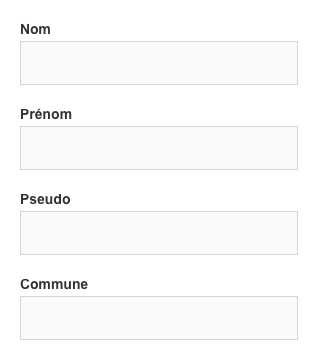
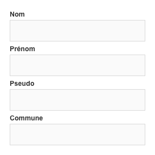

# Margins / Marges

Les marges désignent les espaces vides situés autours d'un élément.
Elles sont intentionnelles et étudiées, comme tout élément d’une interface.

## Usage

- Les marges permettent le placement cohérent des éléments, des composants dans une interface.

- Les marges sont uniquement externes. Les paddings sont intégré dans chaque composant.

## Types de Marges

Taille | Mesure | Illustration
------------ | ------------- | ------------- |
**XS** | 5px | 
**S** | 10px | 
**M** | 20px | 
**L** | 30px | 
**XL** | 40px | 

## Objectifs

### Améliorer la compréhension

- Les marges permettent d'optimiser la lisibilité d’une page et de facilité la lecture de l'information par l’utilisateur.
- Lors de la lecture, plus l'espacement est grand, plus la compréhension est optimisée. Cependant, de grandes marges diminuent la vitesse de lecture et peuvent déstructurer une page.

### Clarifier les relations

- Les espaces blancs sont des repères visuels.
- Les différents types de marges créent des relations entre les éléments tels que des boutons, titres, articles, etc.
- Les petites marges entre les éléments provoquent une association étroite. Les éléments sont alors liés et forment une unité. Cela crée des sections de contenu sur la page sans avoir à utiliser de lignes ou d’autres éléments graphiques.
- Inversement, les éléments qui ont une grande distance sont dissociés.

 

 |
------------ |
**Do**   Espacer suffisament les composants afin des les distinguer. |

 

 

 |
------------ |
**Don’t**   Dans un champ de texte, le label doit être plus proche du container lié. |

 

 

- Dans un formulaire, l'espace idéal entre 2 champs de texte est M : 20px.

### Hiérarchiser les éléments

- Les éléments plus espacés ont tendance à être plus importants que les éléments moins espacés. Dans une page, un élément de haute importance aura de grandes marges afin d'attirer l'attention de l’utilisateur.

### Attirer l'attention

- Plus il y a d'espaces autour d'un objet, plus l'utilisateur est focaliser sur celui-ci.
