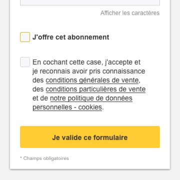
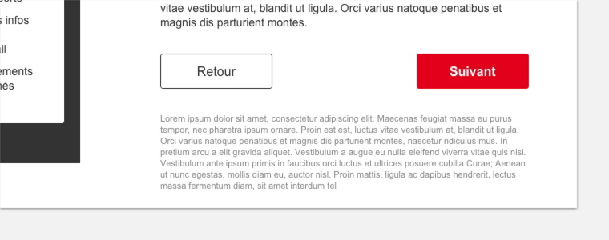
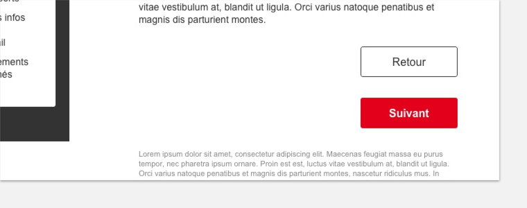

# Buttons

Un bouton indique à l'utilisateur qu'une action est possible.

## 1- Usage

### Primaire

Attirer l'attention, mettre en évidence une action dans un formulaire ou lors d’un changement de page.

### Secondaire
Donner une importance moindre à une action. Généralement, l’utilisateur reste sur la même page.

### Pleine largeur
Donner plus de visibilité et d'accessibilité à une action.

### Pleine largeur Mobile
Donner plus de visibilité et d'accessibilité à une action sur un petit écran.

### Abonnement
Informer sur le contexte Abonnement.

### Premium
Informer sur le contexte Premium.

### Petit bouton
Informer qu'une action mineure.

## 2- États

Type | Class | Enable | Hover / Focus / Pressed | Typographie
------------ | ------------- | ------------- | ------------- | ------------- |
**Primaire** | su-button su-primary |  #E2001A|  #B40015 | Bold #FFFFFF
**Secondaire** | su-button su-secondary |  #333333| #B40015 | Regular #333333 #B40015
**Abonnement** | su-button su-subscription |  #FFCC33 |  #E7AF07 | Bold #333333
**Premium** | su-button su-primary su-premium|   #DBA504 |  #C2940C | Bold #FFFFFF

## 3- Spécifications

- Hauteur : 44px
- Largeur : paddind 20px
- Largueur minimale : 140px
- Border radius : 3px
- Police du thème
- Taille de caractère : 16px
- Opacité d'un bouton inactif (su-disabled) : 40 %

#### Bouton pleine largeur
- su-fullwith
- Largeur : celle son parent moins le padding de celui-ci

#### Bouton pleine largeur Mobile
- su-fullwith-mobile
- Largeur : celle son parent moins le padding de celui-ci

#### Petit bouton
- su-small
- La class : su-small
- Hauteur : 34px
- Padding : 15px
- Taille de caractère : 14px

## 4- Bonnes pratiques

- La 1re lettre du bouton est en majuscule, le reste est en minuscule.
- Le texte du bouton doit être uniquement sur une seule ligne.
- Mettre le minimum de texte dans le bouton  tout en expliquant clairement ce qui se passe lorsque ce bouton est activé.

  |
------------ | ------------- | ------------- | -------------
   **Do** Utiliser un texte simple |  **Don't** Ne pas surcharger le texte

- Éviter d'afficher plusieurs boutons primaires. Les secondaires peuvent apparaître plusieurs fois.

- Lorsqu'il y a plusieurs boutons, les classer par ordre d'importance de gauche à droite. Une exeption s'applique obligatoirement dans le cas d'écran séquentiel. Par exemple dans un guide, le bouton "Retour" est à gauche afin de respecter le sens de navigation.

   **Do** Mettre le bouton " Retour " à gauche

- Sur un mobile lorsqu’il y a un seul bouton, le mettre en pleine largeur.

- L'état inactif est utlisé uniquement lorsqu'une autre action doit être effectuer avant que ce bouton ne soit utilisable.

- Ne pas modifiez la police, la couleur, l’angle ou le remplissage des boutons.

- Ne placez pas un bouton sous un autre bouton s'il y a de la place pour les mettre côte à côte.

 **Don't** Ne placez pas ces boutons l'un en dessous de l'autre.

- N'utilisez pas une couleur d'arrière-plan similaire à celle du bouton. Par exemple, n'utilisez pas un fond rose sous un bouton rouge.

## 5- Autres composants
- Liens
- Boutons avec un picto
- Boutons avec un picto et du texte
- Floating action buttons
- “ Voir plus “
- " Lire la suite + "
- “ Votre adresse email OK ”
- " Géolocalisez-vous "
