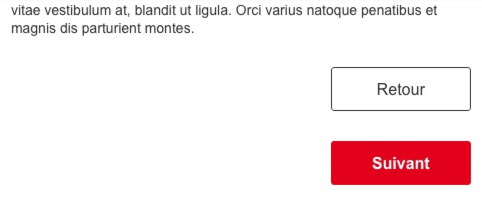

# Buttons/boutons

Les boutons indiquent à l'utilisateur une action qui est accessible par le tap ou le clic. Le texte des boutons aide l'utilisateur à comprendre l'action produite.

## Usage

Les boutons rendent les actions visibles et permettent aux utilisateurs d'effectuer une action. Par exemple, utilisez un bouton pour permettre aux utilisateurs de souscrire à un abonnement.

## Types de boutons

### Bouton primaire

Le bouton principal, sur fond de couleur, met en évidence une action importante dans une page. Il est utilisé principalement sur une action spécifique ou dans un formulaire. Son utilisation dans une page doit être limitée.

Enabled | Hover / Focus / Pressed | Inactif
------------ | ------------- | ------------- |
| | 
Hauteur : 44px    Largeur : minimum 140px et padding 20px    Largeur : minimum 140px et padding 20px    Contour : angle 3px    Couleur : #E2001A      Contour : angle 3px    Texte : 16px, bold, police du thème, #FFFFFF | -   -   -   -   -   -   Texte : #B40015 | Opacité : 40 %

#### Cas spécifiques

##### Bouton pleine largeur

Le bouton pleine largeur s'adapte à la largeur du container (Mobile et Desktop).

##### Bouton primaire, hauteur 34px

Le bouton primaire de 34px de haut est utilisé dans des cas spécifiques et principalement sur Desktop.

  Enabled | Hover / Focus / Pressed | Inactif
  ------------ | ------------- | ------------- |
  || 
  Hauteur : 34px    Largeur : minimum 100px et padding 15px    Contour : angle 3px   Couleur : #E2001A   Texte : 14px, regular, police du thème, #FFFFFF | -   -   -   Couleur : transparent   Texte : #B40015 | Opacité : 40 %

##### Bouton primaire, contexte Abonnement

Dans un contexte Abonnment, la couleur de fond du bouton primaire devient #FFCC33 et celle du texte #333333.

  Enabled | Hover / Focus / Pressed
  ------------ | -------------
|   
Couleur : #FFCC33 |  Couleur : #E7AF07

##### Bouton primaire, contexte Premium

Dans un contexte Premium, la couleur de fond du bouton primaire devient #DBA504.

  Enabled | Hover / Focus / Pressed
  ------------ | -------------
|   
Couleur : #DBA504 |  Couleur : #C2940C

### Bouton secondaire

Le bouton secondaire transparent avec un cadre fin est utilisé pour des actions de moindre importance. Il est souvent associé avec le bouton primaire.

Enabled | Hover / Focus / Pressed | Inactif
------------ | ------------- | ------------- |
| | 
Hauteur : 44px    Largeur : minimum 140px et padding 20px    Contour : angle 3px   Couleur : #333333 et transparent    Texte : 16px, regular, police du thème, #333333 | -   -   -   Couleur : #B40015   Texte : #B40015 | Opacité : 40 %

#### Cas spécifique
##### Bouton secondaire, hauteur 34px

Le bouton primaire de 34px de haut est utilisé dans des cas spécifiques et principalement sur Desktop.

Enabled | Hover / Focus / Pressed | Inactif
------------ | ------------- | ------------- |
| | 
Hauteur : 34px    Largeur : minimum 100px et padding 15px    Contour : épaisseur 1px, angle 3px   Couleur : #333333 et transparent   Texte : 14px, regular, police du thème, #333333 | -   -   -   Couleur : #B40015   Texte : #B40015 | Opacité : 40 %

## Bonnes pratiques

- La 1re lettre du bouton est en majuscule, le reste est en minuscule.
- Le texte du bouton est limité à une ligne.
- Le texte du bouton doit être explicite et décrire l'action de celui-ci.

 

 
  |
------------ |
**Do**   Utiliser un texte simple |
  
 

  
 

 
  |
------------ |
**Don’t**   Ne pas surcharger le texte |
  
 

 

- Lorsque vous utilisez un bouton primaire et un bouton secondaire, le bouton primaire doit être placé à gauche. **Une exception s'applique dans le cas d'écran séquentiel**, le bouton primaire est à droite.

 
  |
------------ |
**Do**   Mettre le bouton «&nbsp;Retour&nbsp;» à gauche

 

 

- Sur un mobile lorsqu’il y a un seul bouton, le mettre en pleine largeur.

- Ne placez pas un bouton sous un autre bouton s'il y a de la place pour les mettre côte à côte. |

  
 

 

 
  |
------------ |
**Don’t**   Ne placez pas ces boutons les uns en dessous de l'autre.
  
 

 

- La couleur d'arrière-plan ne doit pas être similaire à celle du bouton afin de mettre en avant l'action. Par exemple, le fond noir est à proscrire sous un bouton rouge.

## Autres composants
- Liens
- Boutons avec un picto
- Floating action buttons
- “ Voir plus “
- " Lire la suite + "
- “ Votre adresse email OK ”
- " Géolocalisez-vous "
