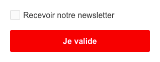
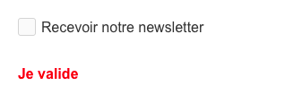
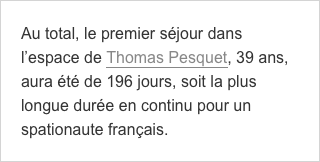
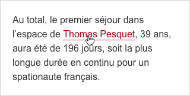

# Links/liens

Les liens permettent à l'utilisateur d'atteindre un autre endroit de la page, une autre page, un autre site ou un document non web.

## Usage

Les liens rendent les actions visibles et permettent aux utilisateurs d'effectuer une action. Par exemple dans un article, un lien permet d'ouvrir un autre article.

## Types de liens
### Lien éditorial
Un lien éditorial se trouve **parmi un bloc de texte** (article…). Il apporte une information supplémentaire.

Enable | Hover / Focus / Pressed
------------ | ------------- |
image |
Hauteur du texte    Largeur du texte   Couleur : #E2001A   Taille de caractère de son contexte    Graisse de son contexte   Police du thème | -   -   Couleur : #B40015   -   -   -   Texte : le lien est souligné en #B40015  

### Lien bouton
Un «&nbsp;lien bouton&nbsp;» se positionne comme un bouton mais a l’apparence d’un lien. Son action est mineure par rapport aux boutons primaires et secondaires. Un tel lien ne peut donc pas être inclus dans du texte.

Enable | Hover / Focus / Pressed | Disabled
------------ | ------------- | ------------- |
image |  | image
Hauteur : 44px    Largeur du texte   Couleur : #E2001A   Taille de caractère : 16px   Graisse : bold   Police du thème | -   -   Couleur : #B40015    -   -   -   Texte : le lien est souligné en #B40015 | Opacité : 40 %

Contrairement aux boutons primaires et secondaires, le lien bouton ne présente pas de padding et sa largeur minimale n'est pas définie.

## Bonnes pratiques
### Comportement
 |
------------ | -------------
   **Do** Si l'action modifie des données, utiliser un bouton. |  **Don't** Si l'action modifie des données, ne pas utiliser un lien.

- Do **!!!image!!!** France 3 Auvergne Rhône Alpes. Lorsque le lien dirige vers un autre site, l'indiquer à l'utilisateur.

### Contenu

- Mettre le minimum de texte tout en expliquant clairement ce qui se passe lorsque ce lien est activé.
- Évitez les termes génériques tels que «Cliquez ici», «Ici», «En savoir plus» ou l'adresse Web qui ne fournissent pas d'information aux utilisateurs sur le contenu du lien.
- Sur une même page, mettre des noms distincts pour des liens différents.
#### Lien éditorial

Enable | Hover / Focus / Pressed
------------ | -------------
 |

- Commencer par les mots-clés.
- Il est conseillé que le lien n’ait pas plus de 10 mots pour une meilleure performance.
- Le texte du lien doit être similaire au titre de la page qu'il ouvre.
- Ne pas mettre le même nom pour différents liens.

 **Don't** Ne pas mettre un texte en rouge souligné pour le mettre en évidence

#### Lien bouton
- La 1re lettre du lien est en majuscule, le reste est en minuscule.
- Le texte du lien doit être uniquement sur une seule ligne.

## Autres composants
- Titre avec chevron
- Lien blank
- Lien download
- Partage social
- Fil d’ariane
